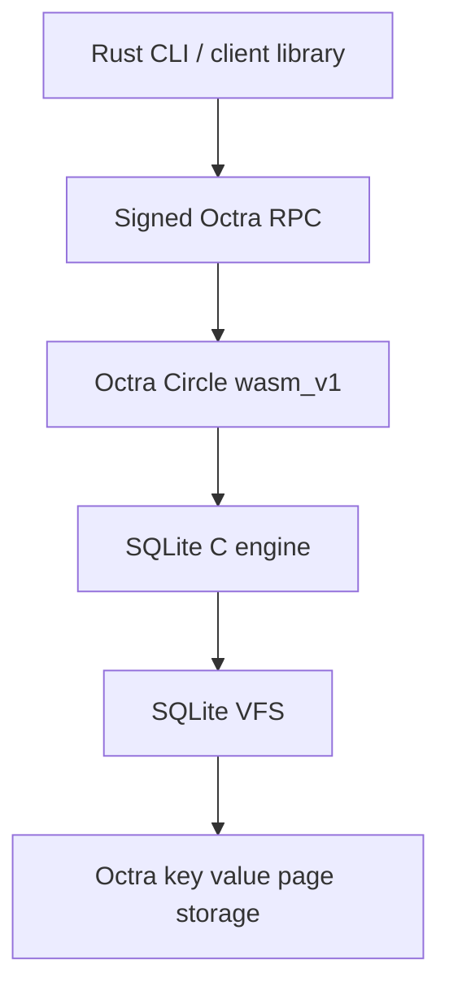

# octra-sqlite

**Real SQLite inside an Octra Circle.**

[](./LICENSE)
[](./release/octra-sqlite-0.4.0.json)
[](https://sqlite.org/)

`octra-sqlite` runs the SQLite C engine inside an Octra `wasm_v1` Circle.
The Rust CLI deploys the bundled Circle WASM, signs Octra RPC calls when a
wallet is needed, and gives you a SQLite-shaped interface over live Circle
state.

## Cold Start

You need Rust/Cargo 1.87+. The Circle WASM is bundled; you do not need to
compile it to start.

```sh
git clone https://github.com/tomismeta/octra-sqlite.git
cd octra-sqlite
cargo install --path . --locked
```

Read a public database immediately, no wallet required:

```sh
octra-sqlite 'oct://devnet/octQfYK2fE9RvR9kfj8FJfMBQw1e4EzfHB8Q5Z9J2DCnRBQ?read_mode=public' \
  "select id, name from artist order by id;"
```

Or open it in the interactive `sqlite>` shell:

```sh
octra-sqlite open 'oct://devnet/octQfYK2fE9RvR9kfj8FJfMBQw1e4EzfHB8Q5Z9J2DCnRBQ?read_mode=public'
```

Create a database when you have a funded Octra wallet:

```sh
octra-sqlite setup
octra-sqlite new art < examples/artists.sql
octra-sqlite status art --ready
octra-sqlite art "select * from artist order by name;"
```

Pinned install:

```sh
cargo install --git https://github.com/tomismeta/octra-sqlite --tag v0.4.0 --locked
```

Guided wallet setup:

```sh
octra-sqlite setup
```

The setup flow is the first door. It finds an existing configured wallet when
possible; otherwise it offers four safe paths:

```text
1. Import wallet.json from the official Octra wallet generator
2. Attach an existing plaintext wallet.json
3. Paste a private key into a hidden prompt
4. Continue without a wallet for public-read databases
```

Generator imports accept the downloaded Octra `wallet.json` from
[wallet.octra.org](https://wallet.octra.org) directly, copy it to the configured
wallet path with restricted permissions where supported, and tell you to remove
the downloaded copy. Secure paste never echoes the key. Sealed reads and all
writes require a wallet; public-read queries do not.

For scripts and servers:

```sh
octra-sqlite wallet attach ./wallet.json
printf '%s' "$OCTRA_PRIVATE_KEY_B64" | octra-sqlite wallet import --stdin --output ./wallet.json
```

WebCLI `.oct` files are encrypted/PIN-protected and are not imported directly;
use the official `wallet.json`, attach plaintext wallet JSON, or paste/import
the private key.

Create directly with inline SQL:

```sh
octra-sqlite new art "create table artist(id integer primary key, name text not null);"
```

Or use the guided flow:

```sh
octra-sqlite new
octra-sqlite art
```

The guided flow asks for an explicit database name, network, read mode, and
confirmation. If no wallet is configured, it starts wallet setup first. It makes
the new database the default and writes `DATABASE.octra-sqlite.json`. Network
defaults to `devnet`; read mode defaults to `sealed`. Choose `public` only for
data intended to be publicly queryable.

## Interfaces

- Human CLI: `octra-sqlite setup`, `octra-sqlite new`, `octra-sqlite DATABASE`,
  and the `sqlite>` shell.
- Machine CLI: use `--json`, `--json-summary`, full `oct://NETWORK/<circle>`
  URIs, `status --ready`, `commands --json`, and `limits --json`.
- Rust client: use the same reference client without shelling out.

```rust
use octra_sqlite::client::OctraSqlite;

let client = OctraSqlite::from_default_config()?;
let db = client.database("art")?;
let rows = db.query("select * from artist order by name;")?;
```

## CLI Commands

In commands below, `DATABASE` can be a saved database name or a raw `oct://`
URI.

| Command | Purpose |
| --- | --- |
| `octra-sqlite setup` | Configure wallet and network defaults, with guided wallet setup when needed. |
| `octra-sqlite wallet attach PATH` | Use an existing plaintext wallet JSON. |
| `octra-sqlite wallet import --stdin` | Import a private key into a local wallet JSON. |
| `octra-sqlite status [DATABASE]` | Check config, wallet, WASM, Circle, auth, and SQLite health. |
| `octra-sqlite status DATABASE --ready` | Exit nonzero unless the database is operational. |
| `octra-sqlite config` | Show local config, networks, RPC, explorer, and saved databases. |
| `octra-sqlite new DATABASE [SQL]` | Create a new Circle-backed SQLite database. |
| `octra-sqlite new` | Open the guided database creation flow. |
| `octra-sqlite new DATABASE --schema FILE --manifest FILE --json` | Create from a SQL file and emit machine-readable output. |
| `octra-sqlite new DATABASE --sample NAME` | Create from an explicit built-in sample. |
| `octra-sqlite new DATABASE --read-mode public` | Create a public-read database; writes remain owner-signed. |
| `octra-sqlite DATABASE "SQL"` | Run SQL. |
| `octra-sqlite DATABASE --sql-file FILE` | Run SQL from a file. |
| `octra-sqlite DATABASE --trace-rpc-json trace.jsonl "SQL"` | Trace read JSON-RPC envelopes. |
| `octra-sqlite DATABASE --trace-rpc-json trace.jsonl --trace-rpc-json-mode summary "SQL"` | Trace compact read proof metadata. |
| `octra-sqlite DATABASE --read-only "SQL"` | Refuse to submit writes from this command. |
| `octra-sqlite DATABASE ".COMMAND"` | Run a SQLite-style dot command. |
| `octra-sqlite open DATABASE` | Open the interactive shell. |
| `octra-sqlite restore DATABASE --file dump.sql` | Restore large SQL text with chunked execution. |
| `octra-sqlite check DATABASE --sql-file dump.sql` | Check script size and batching without writing. |
| `octra-sqlite limits [DATABASE]` | Show SQL, restore, transaction, and auth limits. |
| `octra-sqlite commands` | Show supported CLI commands and JSON envelopes. |
| `octra-sqlite database list` | List saved database names. |
| `octra-sqlite database info [DATABASE]` | Show database URI, Circle ID, network, and RPC. |
| `octra-sqlite database set NAME URI` | Save an `oct://` database URI locally. |
| `octra-sqlite verify [DATABASE]` | Verify live Circle SQLite status. |
| `octra-sqlite deploy [OPTIONS]` | Update an existing Circle with Circle WASM. |
| `octra-sqlite help` | Show CLI help. |

## Read Modes

Databases are sealed by default. Sealed databases use signed Octra view auth for
reads and owner-signed OSW1 writes for writes.

Public-read databases are explicit:

```sh
octra-sqlite new public_art --read-mode public --schema examples/artists.sql
```

Public-read databases use unsigned Octra Circle views for SQL reads. Anyone can
query public data. Writes are still owner-signed OSW1 calls.
When using a raw URI instead of a saved database name, mark public reads
explicitly:

```sh
octra-sqlite 'oct://devnet/oct...?read_mode=public' "select * from artist;"
```

## `sqlite>` Shell

Run `octra-sqlite DATABASE` or `octra-sqlite open DATABASE` to enter the shell.

```sql
sqlite> select id, name
   ...> from artist
   ...> order by name;
sqlite> .tables
sqlite> .quit
```

`sqlite>` is ready for a new SQL statement or dot command. `...>` is waiting
for the rest of a multiline SQL statement. SQL runs when it ends with `;`.
Dot commands run immediately.

| Dot command | Origin | Purpose |
| --- | --- | --- |
| `.help` | SQLite | Show shell commands. |
| `.tables` | SQLite | List tables. |
| `.schema [TABLE]` | SQLite | Show schema. |
| `.indexes [TABLE]` | SQLite | List indexes. |
| `.mode MODE` | SQLite | Set output mode: `box`, `table`, `list`, `json`, `line`, or `csv`. |
| `.headers on\|off` | SQLite | Show or hide column headers. |
| `.backup main FILE` | SQLite | Save a local `.sqlite` backup. |
| `.save FILE` | SQLite | Save a local `.sqlite` backup. |
| `.dump [TABLE]` | SQLite | Print SQL text for restore or inspection. |
| `.read FILE` | SQLite | Execute SQL from a file. |
| `.import --csv FILE TABLE` | SQLite | Import CSV rows. |
| `.output FILE` | SQLite | Redirect output. |
| `.once FILE` | SQLite | Redirect one command. |
| `.fullschema` | SQLite | Show schema plus SQLite metadata. |
| `.databases` | SQLite | Show the current database URI. |
| `.open DATABASE` | SQLite | Switch database. |
| `.timer on\|off` | SQLite | Show query timing. |
| `.show` | SQLite | Show shell settings. |
| `.quit` / `.exit` | SQLite | Exit the shell. |
| `.circle` | Octra | Show Circle metadata. |
| `.wallet` | Octra | Show active wallet. |
| `.storage` | Octra | Show SQLite page storage info. |
| `.verify` | Octra | Verify live Circle SQLite status. |

## Backup And Restore

```sh
octra-sqlite art ".backup main art.sqlite"
sqlite3 art.sqlite "pragma integrity_check;"

octra-sqlite art ".dump" > art.sql
octra-sqlite new art_copy
octra-sqlite restore art_copy --file art.sql
```

Local `sqlite3` is optional. It is used only for exported-file integrity checks
and snapshot rendering commands such as `.dump` and `.fullschema`. The
`octra-sqlite` commands talk to the Octra Circle.

## Architecture



The contract keeps the consensus surface small: SQLite runs SQL, the VFS stores
SQLite pages in Octra storage, and the Rust client handles signing, rendering,
backup, restore, and local developer experience.

## Reference

- [Examples](./examples/)
- [Release manifests](./release/)
- [Public surface](./docs/public-surface.md)
- [Headless setup](./docs/headless.md)
- [JSON output](./docs/json-output.md)
- [Operations](./docs/operations.md)
- [Storage model](./docs/storage-model.md)
- [Toolchain and builds](./docs/toolchain.md)
- [OSR1 typed results](./docs/spec/osr1.md)
- [OSW1 owner write intent](./docs/spec/osw1.md)
