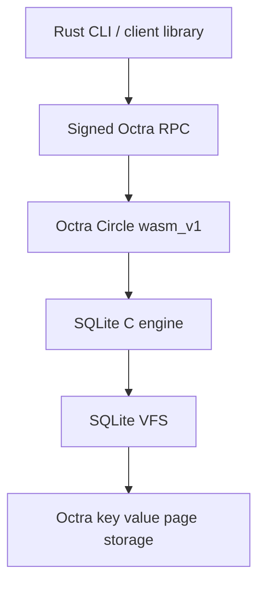

# octra-sqlite

**Real SQLite inside an Octra Circle.**

[](./LICENSE)
[](./release/octra-sqlite-0.3.1.json)
[](https://sqlite.org/)

`octra-sqlite` runs the SQLite C engine inside an Octra `wasm_v1` Circle.
The Rust CLI deploys the bundled Circle WASM, signs Octra RPC calls with your
wallet, and gives you a SQLite-shaped interface over live Circle state.

## Cold Start

You need Rust/Cargo and an Octra wallet. Writes and new databases need a funded
wallet. The Circle WASM is bundled; you do not need to compile it to start.

```sh
git clone https://github.com/tomismeta/octra-sqlite.git
cd octra-sqlite
cargo install --path . --locked

octra-sqlite setup
octra-sqlite status
```

Create a new Circle-backed SQLite database:

```sh
octra-sqlite new art "
create table artist(
  id integer primary key,
  name text not null
);

insert into artist(name) values ('Monet'), ('Picasso'), ('Rembrandt'), ('Basquiat');
"
```

Query it:

```sh
octra-sqlite art "select * from artist;"
octra-sqlite art ".tables"
octra-sqlite art ".schema artist"
```

Open the interactive shell:

```sh
octra-sqlite art
```

For scriptable setup:

```sh
octra-sqlite init --wallet ./wallet.json
```

## CLI Commands

| Command | Purpose |
| --- | --- |
| `octra-sqlite setup` | Configure wallet, network, RPC, and defaults. |
| `octra-sqlite init [OPTIONS]` | Scriptable setup. |
| `octra-sqlite status [DATABASE]` | Check config, wallet, WASM, Circle, auth, and SQLite health. |
| `octra-sqlite config` | Show local config, networks, RPC, explorer, and saved databases. |
| `octra-sqlite new DATABASE [SQL]` | Create a new Circle-backed SQLite database. |
| `octra-sqlite quickstart DATABASE --sample NAME` | Create a database from an explicit built-in sample. |
| `octra-sqlite DATABASE "SQL"` | Run SQL against a saved database. |
| `octra-sqlite DATABASE --sql-file FILE` | Run SQL from a file against a saved database. |
| `octra-sqlite DATABASE ".COMMAND"` | Run a SQLite-style dot command. |
| `octra-sqlite open DATABASE` | Open the interactive shell. |
| `octra-sqlite restore DATABASE --file dump.sql` | Restore large SQL text with chunked execution. |
| `octra-sqlite check DATABASE --sql-file dump.sql` | Check script size and batching without writing. |
| `octra-sqlite limits [DATABASE]` | Show SQL, restore, transaction, and auth limits. |
| `octra-sqlite database list` | List saved database names. |
| `octra-sqlite database info [DATABASE]` | Show database URI, Circle ID, network, and RPC. |
| `octra-sqlite database set NAME URI` | Save an `oct://` database URI locally. |
| `octra-sqlite verify [DATABASE]` | Verify live Circle SQLite status. |
| `octra-sqlite deploy [OPTIONS]` | Update an existing Circle with Circle WASM. |
| `octra-sqlite help` | Show CLI help. |

## `sqlite>` Shell

Run `octra-sqlite DATABASE` to enter the shell.

```sql
sqlite> select id, name
   ...> from artist
   ...> order by name;
sqlite> .tables
sqlite> .quit
```

`sqlite>` is ready for a new SQL statement or dot command. `...>` is waiting
for the rest of a multiline SQL statement. SQL runs when it ends with `;`.
Dot commands run immediately.

| Dot command | Origin | Purpose |
| --- | --- | --- |
| `.help` | SQLite | Show shell commands. |
| `.tables` | SQLite | List tables. |
| `.schema [TABLE]` | SQLite | Show schema. |
| `.indexes [TABLE]` | SQLite | List indexes. |
| `.mode MODE` | SQLite | Set output mode: `box`, `table`, `list`, `json`, `line`, or `csv`. |
| `.headers on\|off` | SQLite | Show or hide column headers. |
| `.backup main FILE` | SQLite | Save a local `.sqlite` backup. |
| `.save FILE` | SQLite | Save a local `.sqlite` backup. |
| `.dump [TABLE]` | SQLite | Print SQL text for restore or inspection. |
| `.read FILE` | SQLite | Execute SQL from a file. |
| `.import --csv FILE TABLE` | SQLite | Import CSV rows. |
| `.output FILE` | SQLite | Redirect output. |
| `.once FILE` | SQLite | Redirect one command. |
| `.fullschema` | SQLite | Show schema plus SQLite metadata. |
| `.databases` | SQLite | Show the current database URI. |
| `.open DATABASE` | SQLite | Switch database. |
| `.timer on\|off` | SQLite | Show query timing. |
| `.show` | SQLite | Show shell settings. |
| `.quit` / `.exit` | SQLite | Exit the shell. |
| `.circle` | Octra | Show Circle metadata. |
| `.wallet` | Octra | Show active wallet. |
| `.storage` | Octra | Show SQLite page storage info. |
| `.verify` | Octra | Verify live Circle SQLite status. |

## Backup And Restore

```sh
octra-sqlite art ".backup main art.sqlite"
sqlite3 art.sqlite "pragma integrity_check;"

octra-sqlite art ".dump" > art.sql
octra-sqlite new art_copy
octra-sqlite restore art_copy --file art.sql
```

Local `sqlite3` is optional. It is used only for exported-file integrity checks
and snapshot rendering commands such as `.dump` and `.fullschema`. The
`octra-sqlite` commands talk to the Octra Circle.

## Architecture



The contract keeps the consensus surface small: SQLite runs SQL, the VFS stores
SQLite pages in Octra storage, and the Rust client handles signing, rendering,
backup, restore, and local developer experience.

## Reference

- [Examples](./examples/)
- [Release manifests](./release/)
- [Public surface](./docs/public-surface.md)
- [Headless setup](./docs/headless.md)
- [Operations](./docs/operations.md)
- [Storage model](./docs/storage-model.md)
- [Toolchain and builds](./docs/toolchain.md)
- [OSR1 typed results](./docs/spec/osr1.md)
- [OSW1 owner write intent](./docs/spec/osw1.md)
